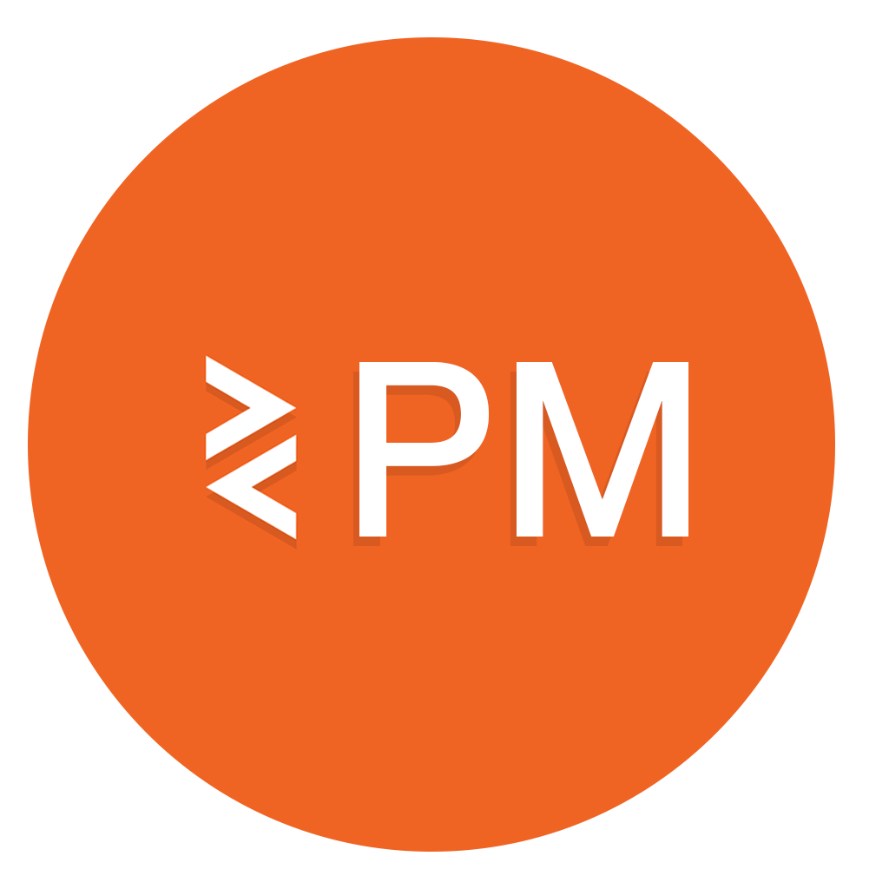

<div >
  <br>
  
  <h1 display='inline'  >PlayBuild</h1>
  <h3>A bundler and Package Manager for PlayCanvas</h3>
  <h4><a href='https://github.com/marklundin/pcpm/wiki/Getting-Started'>Getting Started</a></h4>
</div
  
PlayBuild is a in-editor compiler, bundler and package manager for the PlayCanvas editor that adds support for Javascript Modules, TypeScript JSX and all the usual features of modern web tooling. 

```javascript
// Import code from other scripts
import config from './config'

// import npm libs
import { firebaseApp } from 'firebase/app'
import React from 'react'

var MyScript = pc.createScript('myScript')

// initialize code called once per entity
MyScript.prototype.initialize = function() {

    // Import your own modules
    const key = config.firebaseKey

    // Use NPM modules
    const app = firebaseApp(key)
}
```


When you're creating games in PlayCanvas you'll often find yourself wanting to structure your code in a better way, seperating out utilities and config files, res-usable classes, or simply to import some code from a 3rd party libray. Whilst there are a few ways to achieve this they often feel like a workaround that don't quite line up with modern javsacript tooling. PlayBuild allows you to use js modules and npm libraries in your PlayCanvas projects, it supports all the usual features such as de-duping, minification and dead code removal and more. It also has preliminary support for JSX and TypeScript.

### How does this all work?
PlayBuild is a compiler built around [ESBuild](https://github.com/evanw/esbuild) that syncs with your project and compiles and bundles your code. Your asset registry is treated as a regular file system so local modules can be resolved and remote modules can be imported. There is no run-time dependancy on external CDN's.

### Gotchas & Known Issues

#### I can't use package XYZ
In theory, any package from [NPM](https://www.npmjs.com/) should work out of the box, but in practice some modules may have some limitations or strong dependancies on how they're used. If there's a specific module not working for you, report an issue.

#### I can't use a package with a wasm binary
All remote packages are loaded from a CDN which means any hardcoded references to local wasm binaries may fail. Instead see if you can instantiate the binaries by pointing to a remote hosted CDN

#### It always opens the built.js file when I hit edit in the editor
Because of the way PlayCanvas associates scripts with particular assets and because all scripts are compiled into a built version, the editor will always open the built.js for any given script

#### I can't install modules from github or from private accounts
The semantics of modules in package.json doesn't map exactly to how they're used in local projects. This means that scoped imports such as @org/somemodule or [urls modules](https://docs.npmjs.com/cli/v8/configuring-npm/package-json#urls-as-dependencies) do not work for now. If in doubt, use the package manager UI rather than manually editing the package.json file
