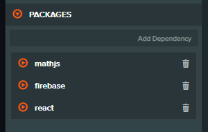

<div align="center">
  <br>
  
  <br>
  <h3 align="center">A Package Manager for PlayCanvas</h3>
  <br>
  <br>
</div>

<!-- <p align="center"> -->
<!--   <a href="#key-features">Key Features</a> • -->
<!--   <a href="#getting-started">Getting Started</a> • -->
<!--   <a href="#download">Download</a> • -->
<!--   <a href="#credits">Credits</a> • -->
<!--   <a href="#related">Related</a> • -->
<!--   <a href="#license">License</a> -->
<!-- </p> -->

<!--PCPM is an extension for the PlayCanvas Editor that adds support for Javascript Modules, TypeScript JSX and more. Your PlayCanvas scripts become JS modules which means you can import and export code.-->

## Why?
When you're creating games in PlayCanvas you'll often find yourself wanting to import or share common code between files, or import some code from a 3rd party libray. Whilst there are a few ways to achieve this they often feel like a workaround. PCPM adds supports for js modules and allows you to import local code, install npm and use ~~TypeScript~~ and ~~JSX~~ in the code editor

```javascript

// JS Modules FTW!

import config from './config'
import { weirdLerp } from './utils/math'
import { firebaseApp } from 'firebase/app'

var MyScript = pc.createScript('myScript')

// initialize code called once per entity
MyScript.prototype.initialize = function() {

    // Import your own modules
    const value = weirdLerp(20, 0, 1)

    // Use NPM modules
    const app = firebaseApp(config)
}
```

## Getting Started

Grab the PCPM extension from the Chrome Webstore then open up or create a new project in PlayCanvas.

PCPM is opt-in only. It will only run if a *package.json* file exists at the root of the asset registry. To initialize your project to use PCPM, open the **Package Manager Settings** in the Edittor Settings Panel and click the *'+ Add package.json'*.


### Importing Modules

PCPM upgrades your scripts to first class [js modules](https://developer.mozilla.org/en-US/docs/Web/JavaScript/Reference/Statements/import) which means you can export code from any script 

```javascript 
export const util
```
and import it into another
```javascript 
import { util } from './myutils'
``` 

### Import Packages


<br>

Using the PCPM Search in the code editor you can also find and install any publicy hosted npm pacakges. You can them import the package and use it like any other module

```javascript
import lodash from 'lodash'
import { firebaseApp } from 'firebase/app'

const MyScript =  pc.createScript('myScript')
```

### TypeScript
PCPM also proves experimental support for using TypeScript in your projects

### JSX
Experimental support for JSX is coming soon

### Known Issues
PCPM relies on the public [PlayCanvas Editor api](https://github.com/playcanvas/editor-api) & private internal api's, and as such, it's highly exposed to any updates to the PlayCanvas Editor. __Therefore things are subject to break and we'd advise caution using PCPM__. There are also a number of known inherent limitations that can cause [issues](https://github.com/wearekuva/pcpm-private/issues/4) using the code editor
